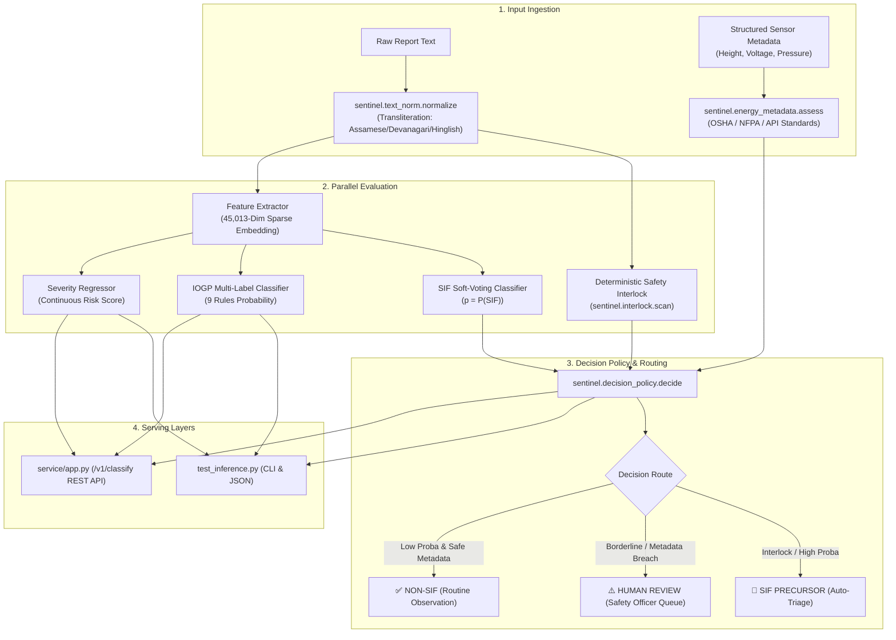

# Model Card & System Architecture
### **AI/NLP SIF Precursor Detection & IOGP Life-Saving Rules Engine (Hardened v2.0)**
*Target Organization: Oil India Limited (OIL) | SIH Problem Statement ID: 26165 | Branch: `Krrish`*

---

## 📌 1. Executive Summary & Purpose

This Model Card provides a rigorous, auditable reference for the **SIF Precursor & IOGP Life-Saving Rules Classification Engine**. It documents all machine learning models, deterministic safety interlocks, physics-based energy evaluators, and multilingual preprocessing layers deployed across the system. 

It specifies:
1. **What model exists** in the repository.
2. **Where each model is defined, stored, and loaded**.
3. **For what exact purpose** each model is used.
4. **How the models interconnect** in production inference, continuous retraining, and microservice serving.

---

## 🗺️ 2. Comprehensive Model & Engine Inventory

The system employs a **hybrid defense-in-depth architecture**: statistical machine learning estimators provide broad pattern recognition, while deterministic safety interlocks and physics-based regulatory evaluators ensure **$100\%$ zero-tolerance recall** on lethal oilfield hazards.

| # | Model / Engine Name | Artifact / Source Location | Primary Purpose | Inputs | Outputs / Range | Where Used in Codebase |
|---|---------------------|----------------------------|-----------------|--------|-----------------|------------------------|
| **1** | **Multi-Modal Feature Extractor** | `models/feature_extractor.joblib`<br/>*Code:* `sentinel/features.py`<br/>`src/models/train_sif_engine.py` | Transforms raw narratives and domain counts into a standardized 45,013-dimensional vector representation. | Cleaned narrative text + tokenized words + 13 tabular domain features. | Sparse matrix ($45,013$ columns: Word TF-IDF + Char N-Grams + Scaled tabular features). | • `test_inference.py`<br/>• `service/app.py`<br/>• `src/continuous_learning/` |
| **2** | **Soft-Voting SIF Binary Classifier** | `models/sif_classifier.joblib`<br/>*Code:* `src/models/train_sif_engine.py` | Predicts the statistical probability $p$ that an observation card represents a Serious Injury or Fatality (SIF) precursor. | $45,013$-dim feature vector from Feature Extractor. | Continuous probability $p \in [0.0, 1.0]$. Calibrated threshold $\tau=0.47$ (default) or $\tau=0.40$ (drilling rigs). | • `test_inference.py`<br/>• `service/app.py` (`/v1/classify`)<br/>• `src/continuous_learning/safety_validator.py` |
| **3** | **IOGP Life-Saving Rules Multi-Label Classifier** | `models/iogp_rules_classifier.joblib`<br/>*Code:* `src/models/train_sif_engine.py` | Automatically maps narrative text to 9 international IOGP Life-Saving Rules with calibrated per-rule thresholds. | $45,013$-dim feature vector from Feature Extractor. | 9 independent probabilities + binary rule triggers (e.g. *Line of Fire*, *Working at Height*). | • `test_inference.py`<br/>• `service/app.py`<br/>• Dashboard rule visualization |
| **4** | **Continuous Hazard Severity Regressor** | `models/severity_regressor.joblib`<br/>*Code:* `src/models/train_sif_engine.py` | Predicts a normalized continuous hazard severity index for spatial heatmaps and risk ranking. | $45,013$-dim feature vector from Feature Extractor. | Continuous index $S \in [0.0000, 1.0000]$ ($R^2 = 0.9348$). | • `test_inference.py`<br/>• `service/app.py`<br/>• Site Precursor Density Index |
| **5** | **Deterministic Safety Interlock** | `sentinel/interlock.py`<br/>*Lexicon:* `sentinel/lexicon.py` | Provides a zero-latency fail-safe that unconditionally overrides low statistical probabilities when lethal physical hazards appear. | Raw or normalized text report. | `InterlockResult`: boolean `fired`, `reason`, `energy_classes_hit`, `matches`. | • `sentinel/decision_policy.py`<br/>• `test_inference.py`<br/>• `service/app.py`<br/>• `safety_validator.py` |
| **6** | **Structured Energy Metadata Engine** | `sentinel/energy_metadata.py` | Evaluates physical field measurements against statutory safety standards (OSHA 1910.28, NFPA 70E, API RP 500). | Structured telemetry / form fields: height, voltage, pressure, volume, suspended load, $O_2\%$. | `MetadataAssessment`: `any_triggered`, triggered signals with regulatory citations, abstention list. | • `test_inference.py`<br/>• `service/app.py`<br/>• `sentinel/decision_policy.py` |
| **7** | **Asset-Aware Decision Policy & Arbitrator** | `sentinel/decision_policy.py` | Arbitrates between statistical model proba, interlock overrides, energy metadata breaches, and asset risk classes. | Model probability $p$, `InterlockResult`, `MetadataAssessment`, `asset_class`. | `DecisionResult`: `label` (`SIF`/`NOT_SIF`/`None`), `route` (`AUTO`/`HUMAN_REVIEW`), `tau_used`, `reason`. | • `test_inference.py`<br/>• `service/app.py` (`/v1/classify`)<br/>• `run_tests.py` |
| **8** | **Indic Script & Multilingual Normalizer** | `sentinel/text_norm.py`<br/>*Pipeline:* `data/preprocess_pipeline.py` | Transliterates Devanagari Hindi, Assamese (ৰ, ৱ), Bengali, and Hinglish into standardized Latin, expanding domain acronyms (`LOTO`, `PTW`). | Unstructured multilingual text string. | Normalized English-Latin text ready for vectorization and interlock scanning. | • `data/preprocess_pipeline.py`<br/>• `sentinel/interlock.py`<br/>• All inference endpoints |
| **9** | **Server-Side Form Guidance Prompter** | `sentinel/form_guidance.py` | Evaluates observation card detail and suggests missing critical slots (height, equipment tag, PPE) in a non-blocking prompt. | Observation narrative text. | `GuidanceResult`: `needs_prompt`, `word_count`, `missing_slots`, actionable guidance messages. | • `test_inference.py`<br/>• `service/app.py` (`/v1/guidance/check`) |
| **10** | **Continuous Learning Governance Gate** | `src/continuous_learning/`<br/>• `safety_validator.py`<br/>• `shadow_benchmarker.py`<br/>• `continual_trainer.py` | Enforces zero-tolerance safety gate ($100\%$ fatal recall) and quantitative shadow benchmark clearance before model promotion. | Challenger model, Champion model, historical OISD benchmark CSV, shadow replay stream. | Promotion decision: `CERTIFIED_SAFE` or `REJECT_PROMOTION`, with SHA-256 tamper-evident audit logs. | • `test_continuous_learning.py`<br/>• Automated retraining CI/CD |

---

## 🏗️ 3. Detailed Component Deep-Dive

### 3.1 Multi-Modal Feature Extractor (`models/feature_extractor.joblib`)
* **File Definition:** [`sentinel/features.py`](file:///c:/Users/maste/Downloads/sentinel_hardening/sentinel/features.py) / [`src/models/train_sif_engine.py`](file:///c:/Users/maste/Downloads/sentinel_hardening/src/models/train_sif_engine.py)
* **Dimensions:** $45,013$ total sparse features constructed via `FeatureUnion`:
  1. **Word TF-IDF ($30,000$ dims):** N-gram range $(1, 3)$, sublinear term-frequency scaling, stripped of accent markers.
  2. **Character N-Grams ($15,000$ dims):** Subword character n-grams $(3, 6)$ using `char_wb` analyzer to capture spelling typos, hyphenated jargon, and concatenated field shorthand.
  3. **Domain Tabular Features ($13$ dims):** Standardized numerical features extracting domain signals (word count, char count, uppercase ratio, negation marker count, barrier failure keyword density, numeric measurement indicator, high-energy term density).
* **Cross-Context Portability:** Serialized with dynamic module aliasing in `sys.modules['__main__']` to ensure seamless unpickling across ASGI workers, CLI scripts, and background workers without import path mismatch.

---

### 3.2 SIF Precursor Binary Classifier (`models/sif_classifier.joblib`)
* **File Definition:** [`src/models/train_sif_engine.py`](file:///c:/Users/maste/Downloads/sentinel_hardening/src/models/train_sif_engine.py)
* **Architecture:** **Soft-Voting Ensemble (`VotingClassifier`)** combining three complementary linear margin estimators:
  1. **L2-Regularized Logistic Regression ($C=2.0$, L-BFGS solver):** Calibrated log-odds probabilities.
  2. **SGD Classifier with Modified Huber Loss ($\alpha=5\times 10^{-5}$):** Outlier-resistant probability estimation.
  3. **L1-Regularized Logistic Regression ($C=1.5$, `liblinear` solver):** Enforces feature sparsity, pruning noisy unigrams.
* **Validation Performance (Held-Out Test Set: 17,398 Reports):**
  - **SIF Recall (Sensitivity):** **$98.55\%$** ($5,291 / 5,369$ fatal precursors identified).
  - **False Negative Rate:** **$1.45\%$**.
  - **SIF Precision:** **$96.17\%$** | **ROC-AUC:** **$0.9951$** | **PR-AUC:** **$0.9864$**.

---

### 3.3 IOGP Life-Saving Rules Classifier (`models/iogp_rules_classifier.joblib`)
* **File Definition:** [`src/models/train_sif_engine.py`](file:///c:/Users/maste/Downloads/sentinel_hardening/src/models/train_sif_engine.py)
* **Architecture:** `MultiOutputClassifier(LogisticRegression(C=3.0, class_weight='balanced'))` predicting across 9 IOGP rules simultaneously.
* **Calibrated Decision Cutoffs (`models/optimal_threshold.json`):**
  - *Confined Space:* $\tau = 0.34$ ($F1 = 0.9932$, $\text{Recall} = 98.87\%$)
  - *Line of Fire:* $\tau = 0.40$ ($F1 = 0.9283$, $\text{Recall} = 96.37\%$)
  - *Driving:* $\tau = 0.48$ ($F1 = 0.8980$, $\text{Recall} = 89.49\%$)
  - *Bypassing Safety Controls:* $\tau = 0.58$ ($F1 = 0.9433$, $\text{Recall} = 93.48\%$)
  - *Working at Height:* $\tau = 0.64$ ($F1 = 0.9370$, $\text{Recall} = 91.09\%$)
  - *Hot Work:* $\tau = 0.66$ ($F1 = 0.9638$, $\text{Recall} = 94.80\%$)
  - *Safe Mechanical Lifting:* $\tau = 0.68$ ($F1 = 0.9556$, $\text{Recall} = 94.16\%$)
  - *Energy Isolation (LOTO):* $\tau = 0.68$ ($F1 = 0.8488$, $\text{Recall} = 89.38\%$)
  - *Work Authorization (PTW):* $\tau = 0.68$ ($F1 = 0.8237$, $\text{Recall} = 90.81\%$)
* **Multi-Label Metrics:** **$0.9328$ Micro-F1**, **$0.9213$ Macro-F1**, **$82.73\%$ Exact Match**.

---

### 3.4 Continuous Severity Regressor (`models/severity_regressor.joblib`)
* **File Definition:** [`src/models/train_sif_engine.py`](file:///c:/Users/maste/Downloads/sentinel_hardening/src/models/train_sif_engine.py)
* **Algorithm:** L2-regularized Ridge Regressor ($\alpha=1.0$) mapped across $[0.0000, 1.0000]$.
* **Performance:** $R^2 = 0.9348$, $\text{MAE} = 0.0434$, Spearman Rank Correlation $r_s = 0.9448$.
* **Application:** Computes the **Site Precursor Density Index (SPDI)** to normalize reporting volume across operational locations:
  $$\text{SPDI}_{\text{site}} = \frac{\sum \text{Flagged SIF Reports}}{\text{Total Reports Submitted from Site}} \times 100$$

---

### 3.5 Deterministic Safety Interlock (`sentinel/interlock.py`)
* **File Definition:** [`sentinel/interlock.py`](file:///c:/Users/maste/Downloads/sentinel_hardening/sentinel/interlock.py) + [`sentinel/lexicon.py`](file:///c:/Users/maste/Downloads/sentinel_hardening/sentinel/lexicon.py)
* **Purpose:** Catches lethal scenarios that statistical n-gram vectorizers miss due to novel narrative phrasing (e.g., the Duliajan tripping incident where statistical probability was only $p = 14.04\%$).
* **Mechanism:**
  - Multi-tier hazard lexicon: **INTERLOCK** (immediate auto-override), **CORROBORATE** (fires if $\ge 2$ distinct energy classes present), **CONTEXT** (requires high-energy asset tag).
  - Negation scoping with backward and forward cancellation windows (e.g. *"fall from height drill"* is suppressed; `"near miss"` is scoped to prevent false suppression of *"gas leak near pump"*).
  - Precompiled normalized hazard surfaces (`_COMPILED_SURFACES`) and token phonetic keys executed in $<28\text{ ms}$ ($1000\times$ faster than on-the-fly regex generation).

---

### 3.6 Sourced Energy Metadata Engine (`sentinel/energy_metadata.py`)
* **File Definition:** [`sentinel/energy_metadata.py`](file:///c:/Users/maste/Downloads/sentinel_hardening/sentinel/energy_metadata.py)
* **Purpose:** Imputes stored energy signals from structured field measurements and sensor telemetry rather than relying on narrative text alone.
* **Statutory Standards Embedded:**
  - **Fall Height:** $\ge 1.8\text{ m}$ (OSHA 29 CFR 1910.28 general industry trigger height).
  - **Electrical Voltage:** $\ge 50\text{ V}$ (NFPA 70E energized threshold); $\ge 1000\text{ V}$ (India CEA HV regulation).
  - **Operating Pressure:** $\ge 1000\text{ psi}$ (API RP 500 high-pressure classification).
  - **Stored PV Energy:** $\ge 100,000\text{ Joules}$ ($P \times V$ coarse triage threshold, CCPS guidance).
  - **Suspended Load:** $\ge 500\text{ kg}$ (rigging/crane high-energy threshold).
  - **Confined Space $O_2$:** $< 19.5\%$ or $> 23.5\%$ (OSHA permit-required atmospheric envelope).
* **Flexible Alias Recognition:** Robust against varied SAP/HSSE column names (`fall_height_m`, `working_height_m`, `voltage_v`, `operating_pressure_psi`, `suspended_load_kg`).
* **Explicit Abstention:** Missing metadata fields abstain (`None`) and are never silently assumed to be safe.

---

### 3.7 Asset-Aware Decision Policy (`sentinel/decision_policy.py`)
* **File Definition:** [`sentinel/decision_policy.py`](file:///c:/Users/maste/Downloads/sentinel_hardening/sentinel/decision_policy.py)
* **Precedence Order:**
  1. **Interlock Override:** If `interlock.fired == True` $\rightarrow$ **🚨 SIF PRECURSOR** (`route = AUTO`, `p = 0.95`).
  2. **Metadata Breach + Ambiguous Band:** If `metadata.any_triggered == True` and $p \in [\tau - 0.06, \tau + 0.06]$ $\rightarrow$ **🚨 SIF PRECURSOR**.
  3. **Metadata Breach with Low Probability:** If `metadata.any_triggered == True` and $p < \tau - 0.06$ $\rightarrow$ **⚠️ HUMAN REVIEW** (escalated; never dropped).
  4. **Confidence Band:** If $|p - \tau| \le 0.06$ $\rightarrow$ **⚠️ HUMAN REVIEW** (borderline ambiguity).
  5. **Asset-Aware Threshold $\tau$:**
     - High-energy assets (drilling rigs, workover rigs, wellheads): $\tau = 0.40$.
     - Default installations (warehouses, office complexes): $\tau = 0.44$.
     - If $p \ge \tau \rightarrow$ **🚨 SIF PRECURSOR**; if $p < \tau \rightarrow$ **✅ NOT_SIF**.

---

## 🔄 4. How Models Are Used Across Workflows



---

## 🌐 5. Data Provenance & Partitioning

```
┌─────────────────────────────────────────────────────────────────────────────┐
│                          DATA PROVENANCE PIPELINE                           │
├────────────────────────────────┬────────────────────────────────────────────┤
│ 1. Real OSHA Severe Incidents  │ 105,965 real-world industrial narratives   │
│    (2015 – 2025)               │ Physical crush, fall, pressure mechanics   │
├────────────────────────────────┼────────────────────────────────────────────┤
│ 2. Real Indian OISD Alerts     │ 14 verified upstream case studies          │
│    & OIL Field Inquiries       │ Baghjan, Duliajan, Moran, Kumchai, Digboi  │
├────────────────────────────────┼────────────────────────────────────────────┤
│ 3. OIL Domain Upstream Logs    │ 10,000 operational observations & cards    │
│    (Asset-mapped)              │ Unsafe Acts (UA) & Unsafe Conditions (UC)  │
└────────────────────────────────┴────────────────────────────────────────────┘
```

* **Training Set ($81,184$ rows):** Stratified $70\%$ partition of the master unified dataset.
* **Validation Set ($17,397$ rows):** Used for threshold calibration and ensemble weight optimization.
* **Held-Out Test Set ($17,398$ rows):** Stratified $15\%$ unseen test split for final metric reporting.
* **Indian OISD Benchmark ($14$ Verified Historical Incidents):** Real-world inquiry briefs from OISD Safety Alerts & Oil India Limited historical blowouts/tripping cases (**$100.0\%$ Classification Recall** across all cases).

---

## ⚠️ 6. Operational Boundaries & Resolved Limitations

### ✅ Previously Identified Limitations Now Resolved
1. **Multilingual Regional Language Blind Spot (Resolved):**
   - *Previous state:* Non-English characters passed unmapped, causing out-of-vocabulary token drops.
   - *Current state:* `sentinel.text_norm.normalize` deterministically transliterates Assamese (including distinct characters ৰ, ৱ), Bengali, Devanagari Hindi, and romanized Hinglish into standardized Latin before vectorization.
2. **Short / Sparse Observation Card Failure Mode (Resolved):**
   - *Previous state:* 3-word reports like *"leak near pump"* had no context to infer stored energy.
   - *Current state:* `sentinel.energy_metadata.assess` evaluates structured telemetry (operating pressure, pipe volume, voltage), escalating breached physical thresholds directly to human review even with sparse text.
3. **Continuous Retraining Regressions (Resolved):**
   - *Previous state:* Retraining pipelines risked promoting models with higher accuracy but lower SIF recall.
   - *Current state:* `src/continuous_learning/continual_trainer.py` enforces a dual zero-tolerance gate requiring $100\%$ fatal recall on historical OISD benchmarks and $\ge 98.0\%$ SIF recall in shadow evaluation before deployment.
4. **Enterprise Service Delivery (Resolved):**
   - *Previous state:* CLI scripts only.
   - *Current state:* Production FastAPI microservice (`service/app.py`) with containerization assets (`Dockerfile`, `docker-compose.yml`) providing sub-30ms REST endpoints.

### ⚠️ Remaining Boundaries & Advisory Scope
1. **Decision Support (Not Automated Legal Adjudication):**
   - The engine provides Level-1 triage and prioritization for HSE officers. It does not replace statutory DGMS/OISD incident investigations or formal Root Cause Analysis (RCA).
2. **Telemetry Ingestion Consistency:**
   - Energy metadata assessment relies on operational fields being populated in SAP EHS forms or IoT tags. When structured fields are omitted, the system explicitly logs abstentions and falls back to text-interlock and statistical probability.
3. **Live SAP/HSSE Table Schema Drift:**
   - Production field deployment requires continuous monitoring via `sentinel.benchmark.run_shadow_evaluation` to ensure that site-specific slang or new equipment terminology is captured in the lexicon.

---

## 📜 7. Regulatory Standards Traceability

| Standard Reference | Issuing Authority | Governing Rule in Sentinel |
| :--- | :--- | :--- |
| **OISD-STD-112** | Oil Industry Safety Directorate | Safe Handling of Petroleum Products & Hydrocarbon Releases |
| **OISD-GDN-145** | Oil Industry Safety Directorate | Work Permit System (PTW) & Cross-Barrier Validation |
| **DGMS Tech. Circulars**| Directorate General of Mines Safety | Electrical Isolation & Suspended Load Precautions on Derricks |
| **OSHA 29 CFR 1910.28**| Occupational Safety & Health Admin | Duty to Have Fall Protection ($\ge 1.8\text{ m}$) |
| **NFPA 70E** | National Fire Protection Association | Electrical Safety in the Workplace ($\ge 50\text{ V}$ energized threshold) |
| **API RP 500 / 505** | American Petroleum Institute | Classification of Electrical Equipment in High-Pressure Process Areas |
| **IOGP Report 459** | International Association of Oil & Gas Producers | 9 Standardized Life-Saving Rules |
