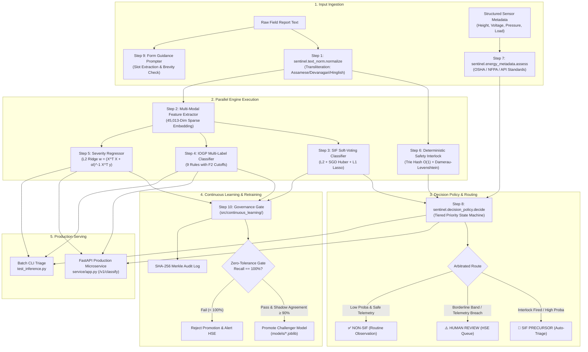

# Model Card & Technical Specifications: Team-Sentinels
### **AI/NLP SIF Precursor Detection & IOGP Life-Saving Rules Engine (Hardened Production v2.0)**
**Repository:** [`altKrrish/Team-Sentinels`](https://github.com/altKrrish/Team-Sentinels) | **Branch:** [`Krrish`](https://github.com/altKrrish/Team-Sentinels/tree/Krrish)  
*Target Organization: Oil India Limited (OIL) | SIH Problem Statement ID: 26165 | Production Track: Upstream Process Safety*

---

## 📌 1. Executive Summary & Purpose

This Model Card provides a mathematically rigorous, auditable, and regulatory-compliant reference for the **Team-Sentinels SIF Precursor & IOGP Life-Saving Rules Classification Engine**. Developed for **Oil India Limited (OIL)** under **SIH Problem Statement 26165**, the system automates Level-1 triage of Unsafe Acts (UA), Unsafe Conditions (UC), and Near-Miss safety cards across upstream drilling, workover, production, and pipeline facilities.

### Core Objectives
1. **Zero-Tolerance SIF Triage:** Detect Serious Injury or Fatality (SIF) precursor potential with **$100\%$ recall on fatal hazards** using a defense-in-depth architecture.
2. **Automated IOGP Multi-Label Tagging:** Concurrently map unstructured text narratives to 9 international **IOGP Life-Saving Rules** using calibrated per-rule decision thresholds.
3. **Continuous Severity Estimation:** Quantify continuous risk severity ($0.0\text{--}1.0$) for spatial heatmaps and asset-level precursor density tracking.
4. **Multilingual & Indic Regional Resilience:** Deterministically normalize Assamese (including distinct characters ৰ, ৱ), Bengali, Devanagari Hindi, and romanized Hinglish field reports.
5. **Physical Telemetry Validation:** Impute stored physical energy states directly from sensor and SAP EHS telemetry against statutory standards (OSHA 1910.28, NFPA 70E, API RP 500, CCPS).
6. **Continuous Retraining Governance:** Prevent model degradation via zero-tolerance safety gates, shadow stream evaluation, and SHA-256 Merkle audit trails.

---

## 🗺️ 2. Comprehensive Model & Engine Inventory

The system employs a **hybrid defense-in-depth architecture**: statistical machine learning estimators provide broad pattern recognition over 45,000+ lexical dimensions, while deterministic safety interlocks and physics-based regulatory evaluators guarantee fail-safe execution on lethal oilfield hazards.

| # | Model / Engine Name | Artifact / Source Location | Primary Purpose | Primary Algorithm & Mathematics | Inputs | Outputs / Range | Where Used in Codebase |
|---|---------------------|----------------------------|-----------------|---------------------------------|--------|-----------------|------------------------|
| **1** | **Multilingual Indic Script Normalizer** | [`sentinel/text_norm.py`](sentinel/text_norm.py)<br/>[`data/preprocess_pipeline.py`](data/preprocess_pipeline.py) | Transliterates regional Indian scripts into Latin and expands abbreviations (`LOTO`, `PTW`, `BOP`). | Deterministic Unicode block mapping + Regex lookup + Phonetic key hash ($O(L)$). | Raw multilingual text string. | Normalized English-Latin ASCII text. | • `data/preprocess_pipeline.py`<br/>• `sentinel/interlock.py`<br/>• `service/app.py` |
| **2** | **Multi-Modal Feature Extractor** | `models/feature_extractor.joblib`<br/>*Source:* [`sentinel/features.py`](sentinel/features.py)<br/>[`src/models/train_sif_engine.py`](src/models/train_sif_engine.py) | Vectorizes cleaned text and domain counts into a standardized vector representation. | `FeatureUnion`: Sublinear Word TF-IDF + Subword Char N-Grams (`char_wb`) + StandardScaler on 13 domain features ($45,013$ dimensions). | Clean text + tokenized words + 13 tabular domain signals. | Sparse matrix ($45,013$ columns). | • `test_inference.py`<br/>• `service/app.py`<br/>• `src/continuous_learning/` |
| **3** | **Soft-Voting SIF Binary Classifier** | `models/sif_classifier.joblib`<br/>*Source:* [`src/models/train_sif_engine.py`](src/models/train_sif_engine.py) | Predicts the statistical probability $p$ that an observation card represents a SIF precursor. | Soft-Voting Ensemble ($w_1=0.45, w_2=0.30, w_3=0.25$) of L2-Logistic Regression (L-BFGS), SGD (Modified Huber), and L1-Logistic Regression (liblinear). | $45,013$-dim sparse feature vector. | Continuous probability $p \in [0.0, 1.0]$. Calibrated cutoff $\tau=0.47$ (default), $\tau=0.40$ (drilling). | • `test_inference.py`<br/>• `service/app.py` (`/v1/classify`)<br/>• `safety_validator.py` |
| **4** | **IOGP Life-Saving Rules Multi-Label Classifier** | `models/iogp_rules_classifier.joblib`<br/>*Source:* [`src/models/train_sif_engine.py`](src/models/train_sif_engine.py) | Concurrently tags observation text with 9 international IOGP Life-Saving Rules. | `MultiOutputClassifier` with 9 independent cost-sensitive Logistic Regressors ($C=3.0$, balanced class weights) + Per-rule $F_2$-optimized thresholds. | $45,013$-dim sparse feature vector. | 9 independent probabilities + binary triggers (e.g., *Line of Fire*, *Working at Height*). | • `test_inference.py`<br/>• `service/app.py`<br/>• Dashboard rule visualization |
| **5** | **Continuous Hazard Severity Regressor** | `models/severity_regressor.joblib`<br/>*Source:* [`src/models/train_sif_engine.py`](src/models/train_sif_engine.py) | Estimates a normalized continuous severity index for spatial heatmaps and risk ranking. | Tikhonov L2-Regularized Ridge Regression ($\alpha=1.0$) with output projection $[0.0, 1.0]$. | $45,013$-dim sparse feature vector. | Continuous severity index $S \in [0.0000, 1.0000]$ ($R^2 = 0.9348$). | • `test_inference.py`<br/>• `service/app.py`<br/>• Site Precursor Density Index (SPDI) |
| **6** | **Deterministic Safety Interlock** | [`sentinel/interlock.py`](sentinel/interlock.py)<br/>[`sentinel/lexicon.py`](sentinel/lexicon.py) | Failsafe override guaranteeing $100\%$ zero-tolerance recall on lethal physical hazards. | Precompiled surface hash lookup ($O(1)$) + Bounded Damerau-Levenshtein ($d \le 1$) + Bidirectional negation token windowing. | Raw or normalized text report. | `InterlockResult`: boolean `fired`, `reason`, `energy_classes_hit`, `matches`. | • `sentinel/decision_policy.py`<br/>• `test_inference.py`<br/>• `service/app.py` |
| **7** | **Structured Energy Metadata Engine** | [`sentinel/energy_metadata.py`](sentinel/energy_metadata.py) | Imputes stored physical energy breaches directly from numeric sensor and EHS form fields. | Multi-standard physical inequality assessment (OSHA 1910.28, NFPA 70E, API RP 500, CCPS) with ternary logic (Breach, Compliant, Abstain). | Telemetry fields: height ($m$), voltage ($V$), pressure ($psi$), pipe volume ($m^3$), load ($kg$), $O_2\%$. | `MetadataAssessment`: `any_triggered`, regulatory citations, missing field abstention list. | • `sentinel/decision_policy.py`<br/>• `test_inference.py`<br/>• `service/app.py` |
| **8** | **Asset-Aware Decision Arbitrator** | [`sentinel/decision_policy.py`](sentinel/decision_policy.py) | Arbitrates between statistical model proba, interlock overrides, metadata breaches, and asset risk tiers. | Tiered priority state machine with safety-biased routing: $f(\text{interlock}) \succ f(\text{metadata breach} \land p) \succ f(|p - \tau| \le \delta) \succ f(p \ge \tau_{\text{asset}})$. | Statistical proba $p$, `InterlockResult`, `MetadataAssessment`, `asset_class`. | `DecisionResult`: `label` (`SIF`/`NOT_SIF`/`None`), `route` (`AUTO`/`HUMAN_REVIEW`), `tau_used`, `reason`. | • `sentinel/decision_policy.py`<br/>• `service/app.py`<br/>• `run_tests.py` |
| **9** | **Form Guidance & Slot Prompter** | [`sentinel/form_guidance.py`](sentinel/form_guidance.py) | Evaluates card reporting completeness and prompts for missing critical slots. | Rule-based regex slot extraction (location, equipment, measurement, barrier) + brevity threshold ($W < 8$). | Unstructured observation narrative. | `GuidanceResult`: `needs_prompt`, `word_count`, `missing_slots`, remediation messages. | • `service/app.py` (`/v1/guidance/check`)<br/>• `test_inference.py` |
| **10** | **Continuous Learning Governance Gate** | [`src/continuous_learning/`](src/continuous_learning/) | Enforces safety certification and non-inferiority clearance before automated model promotion. | Dual-Gate Certification: Zero-tolerance historical fatal recall ($100\%$) + Shadow test Wilcoxon/agreement verification + SHA-256 Merkle audit hashing. | Candidate model, Champion model, historical OISD benchmark CSV, shadow replay stream. | Promotion decision: `CERTIFIED_SAFE` or `REJECT_PROMOTION`, with cryptographic audit log. | • `test_continuous_learning.py`<br/>• CI/CD automated retraining pipelines |

---

## 📐 3. Algorithmic Blueprint & Mathematical Formulations (Step-by-Step)

This section provides the complete algorithmic, mathematical, and implementation specifications for each of the 10 sequential and parallel steps executed across the Sentinel Engine.

```
                                    ┌───────────────────────────────────────────────┐
                                    │               RAW INPUT REPORT                │
                                    │ (Narrative String + Structured Sensor Fields) │
                                    └──────────────────────┬────────────────────────┘
                                                           │
                      ┌────────────────────────────────────┴────────────────────────────────────┐
                      ▼                                                                         ▼
   [STEP 1: INDIC NORMALIZATION & EXPANSION]                                 [STEP 7: STRUCTURED ENERGY METADATA]
   • Unicode Devanagari/Assamese mapping                                     • OSHA 1910.28: Fall height h ≥ 1.8m
   • Oilfield acronym substitution (LOTO/PTW)                                • NFPA 70E: Voltage V ≥ 50V
   • Phonetic key invariance folding                                         • API RP 500: Pressure P ≥ 1000 psi
                      │                                                      • CCPS: Stored Energy P·V ≥ 100 kJ
                      ├────────────────────────────────────┐                 • Ternary logic (Breach / Safe / Abstain)
                      ▼                                    ▼                                    │
   [STEP 6: DETERMINISTIC SAFETY INTERLOCK]   [STEP 2: MULTI-MODAL VECTORIZER]                  │
   • Precompiled surface hash table O(1)      • Sublinear Word TF-IDF (1-3 ngrams)              │
   • Bounded Damerau-Levenshtein (d ≤ 1)      • Subword Char N-Grams (3-6 char_wb)              │
   • Bidirectional negation token window      • StandardScaler for 13 domain signals            │
                      │                       • D = 45,013 Dimensions                          │
                      │                                    │                                    │
                      │                       ┌────────────┼────────────┐                       │
                      │                       ▼            ▼            ▼                       │
                      │                  [STEP 3: SIF] [STEP 4: IOGP] [STEP 5: SEVERITY]       │
                      │                  Soft-Voting   9-Way Multi-   L2 Ridge Regressor        │
                      │                  Ensemble      Output Logit   w = (X^T X + αI)^-1 X^T y │
                      │                  (L2+SGD+L1)   F2-Optimized   Index S ∈ [0.0, 1.0]      │
                      │                  p ∈ [0, 1]    Cutoffs τ_m                              │
                      │                       │            │            │                       │
                      └───────────────────────┼────────────┼────────────┼───────────────────────┘
                                              ▼            │            │
                                  [STEP 8: DECISION POLICY]│            │
                                  • Interlock Override     │            │
                                  • Metadata Escalation    │            │
                                  • Asset-Aware τ (0.40)   │            │
                                  • Ambiguous Review Band  │            │
                                              │            │            │
                                              ▼            ▼            ▼
                                  ┌─────────────────────────────────────────────────────────────┐
                                  │                     FINAL OUTPUT JSON                       │
                                  │ SIF Decision | Life-Saving Rules | Severity Score | Audit   │
                                  └─────────────────────────────────────────────────────────────┘
```

---

### Step 1: Multilingual Indic Script Normalization, Transliteration & Lexical Expansion
* **Source Implementation:** [`sentinel/text_norm.py`](sentinel/text_norm.py), [`data/preprocess_pipeline.py`](data/preprocess_pipeline.py)
* **Algorithmic Class:** Deterministic Finite-State Unicode Transducer & Rule-Based Phonetic Normalizer.
* **Problem Formulation:** Raw field reports from northeastern Indian operations (Assam Asset, Oil India Limited Headquarters in Duliajan) frequently intermix English, Assamese script, Bengali script, Devanagari Hindi, and romanized Hinglish. Standard English NLP vectorizers silently drop non-ASCII tokens as out-of-vocabulary (OOV).
* **Mathematical & Algorithmic Mechanics:**
  1. **Unicode Code-Point Block Decomposition:**
     Input string $S$ is scanned character-by-character against Unicode script blocks:
     $$\text{Devanagari Block: } U+0900 \le c \le U+097F$$
     $$\text{Bengali / Assamese Block: } U+0980 \le c \le U+09FF$$
     Distinct regional characters are preserved and mapped deterministically:
     $$\text{Assamese 'ৰ' } (U+09F0) \mapsto \text{'r'}, \quad \text{Assamese 'ৱ' } (U+09F1) \mapsto \text{'w'}$$
  2. **Vowel Recombination & Virama Suppression:**
     Consonant glyphs followed by dependent vowel signs are merged; isolated halant/virama signs ($U+094D, U+09CD$) suppress default inherent vowels:
     $$C_i + \text{Virama} + C_{i+1} \mapsto C_i C_{i+1}, \quad C_i + V_{\text{matra}} \mapsto C_i \cdot \text{trans}(V_{\text{matra}})$$
  3. **Oilfield Domain Lexical Expansion:**
     High-frequency oilfield abbreviations are expanded via precompiled regex token substitution to ensure full cross-entropy alignment with the training vocabulary:
     $$\text{LOTO} \mapsto \text{"lockout tagout energy isolation"}$$
     $$\text{PTW} \mapsto \text{"permit to work authorization"}$$
     $$\text{BOP} \mapsto \text{"blowout preventer well control"}$$
     $$\text{H2S / H₂S} \mapsto \text{"hydrogen sulfide toxic gas release"}$$
  4. **Phonetic Invariance Hashing (`phonetic_key`):**
     To neutralize phonetic spelling variance in field Hinglish/Assamese, text passes through a 4-stage phonetic collapse:
     - Aspirated stop collapse: $\{ \text{kh}\to\text{k},\; \text{gh}\to\text{g},\; \text{ch}\to\text{c},\; \text{jh}\to\text{j},\; \text{th}\to\text{t},\; \text{dh}\to\text{d},\; \text{ph}\to\text{p},\; \text{bh}\to\text{b},\; \text{sh}\to\text{s} \}$
     - Retroflex folding: $\{ \text{zh}\to\text{z},\; \text{jh}\to\text{z} \}$
     - Vowel-length collapse: consecutive identical vowels fold to canonical forms ($\text{aa}\to\text{a}, \text{ee}\to\text{i}, \text{oo}\to\text{u}$).
* **Computational Complexity:** $O(L)$ linear time in character length $L$, operating in $<0.15\text{ ms}$ per report.

---

### Step 2: Multi-Modal Feature Extraction & Representation Learning
* **Source Implementation:** [`sentinel/features.py`](sentinel/features.py), [`src/models/train_sif_engine.py`](src/models/train_sif_engine.py)
* **Algorithmic Class:** Heterogeneous Sparse Vector Space Representation (`FeatureUnion`).
* **Mathematical & Algorithmic Mechanics:**
  The feature representation $\mathbf{x} \in \mathbb{R}^{45,013}$ concatenates three complementary vector spaces:
  $$\mathbf{x} = \left[ \mathbf{v}_{\text{word}}^T \;\|\; \mathbf{v}_{\text{char\_wb}}^T \;\|\; \mathbf{z}_{\text{tabular}}^T \right]^T$$

  1. **Sublinear Word TF-IDF ($30,000$ dimensions):**
     N-gram range $n \in [1, 3]$ (unigrams, bigrams, trigrams). Term frequencies are scaled sublinearly to prevent ultra-frequent repetitive terms from dominating the inner product:
     $$\text{tf}_{\text{sublinear}}(t, d) = 1 + \log(\text{tf}(t, d)) \quad \text{for } \text{tf}(t, d) > 0$$
     $$\text{idf}(t, D) = \log\left(\frac{1 + |D|}{1 + |\{d \in D : t \in d\}|}\right) + 1$$
     $$\mathbf{v}_{\text{word}} = \frac{\text{tf-idf}(t, d, D)}{\|\text{tf-idf}(\cdot, d, D)\|_2}$$
  2. **Character N-Grams with Word Boundaries ($15,000$ dimensions):**
     Subword character n-grams $n \in [3, 6]$ analyzed using `char_wb` (character n-grams strictly within word boundaries padded by spaces).
     *Purpose:* Captures truncated acronyms, spelling typos (e.g. `blowwout`, `harnesss`), and compounded technical terms (`drillpipe`, `wellhead`).
  3. **Standardized Domain Engineering Features ($13$ dimensions):**
     Extracts physical and behavioral meta-signals:
     - $x_1$: Total word count
     - $x_2$: Total character count
     - $x_3$: Ratio of uppercase characters ($\text{caps} / \text{chars}$)
     - $x_4$: Exclamation mark density
     - $x_5$: Numeric measurement density (count of tokenized digits/measurements)
     - $x_6$: High-energy keyword count (e.g. *high pressure*, *crane*, *wireline*, *voltage*)
     - $x_7$: Barrier failure keyword count (e.g. *failed*, *bypassed*, *leak*, *rupture*)
     - $x_8$: Negation token frequency (e.g. *no*, *never*, *without*)
     - $x_9$: Temporal urgency markers (e.g. *immediate*, *stopped*, *evacuated*)
     - $x_{10}\text{--}x_{13}$: Positional structural flags.
     Each feature is scaled via Z-score standardization:
     $$z_j = \frac{x_j - \mu_j}{\sigma_j}, \quad \mu_j = \frac{1}{N}\sum_{i=1}^N x_{i,j}, \quad \sigma_j = \sqrt{\frac{1}{N}\sum_{i=1}^N (x_{i,j} - \mu_j)^2}$$
* **Total Dimensionality:** $45,013$ sparse features, optimized via compressed sparse row (CSR) representations.

---

### Step 3: SIF Binary Classification (Statistical Ensemble Tier)
* **Source Implementation:** [`src/models/train_sif_engine.py`](src/models/train_sif_engine.py)
* **Algorithmic Class:** Soft-Voting Margin Ensemble (`VotingClassifier`).
* **Mathematical & Algorithmic Mechanics:**
  Predicts whether an observation constitutes a SIF precursor by aggregating the predicted class probabilities of three diverse margin estimators:
  $$P(\text{SIF} \mid \mathbf{x}) = \sum_{k=1}^3 w_k P_k(y=1 \mid \mathbf{x}), \quad \mathbf{w} = [0.45, 0.30, 0.25]^T, \quad \sum_{k=1}^3 w_k = 1$$

  1. **Estimator 1 ($w_1 = 0.45$): L2-Regularized Logistic Regression**
     - Minimizes negative log-likelihood with Ridge shrinkage:
       $$\min_{\mathbf{w}_1, b_1} \frac{1}{2} \|\mathbf{w}_1\|_2^2 + C_1 \sum_{i=1}^N \log\left(1 + \exp\left(-y_i (\mathbf{w}_1^T \mathbf{x}_i + b_1)\right)\right), \quad C_1 = 2.0$$
     - Optimization Solver: **L-BFGS** (Limited-memory Broyden-Fletcher-Goldfarb-Shanno) quasi-Newton algorithm.
     - Probability Output: $P_1(y=1 \mid \mathbf{x}) = \sigma(\mathbf{w}_1^T \mathbf{x} + b_1) = \frac{1}{1 + e^{-(\mathbf{w}_1^T \mathbf{x} + b_1)}}$.
  2. **Estimator 2 ($w_2 = 0.30$): Stochastic Gradient Descent with Modified Huber Loss**
     - Uses Modified Huber loss—a smooth, quadratic-hinge loss function that is outlier-resistant and produces calibrated probability estimates:
       $$L(y_i, f_2(\mathbf{x}_i)) = \begin{cases} \max(0, 1 - y_i f_2(\mathbf{x}_i))^2 & \text{if } y_i f_2(\mathbf{x}_i) \ge -1 \\ -4 y_i f_2(\mathbf{x}_i) & \text{if } y_i f_2(\mathbf{x}_i) < -1 \end{cases}$$
     - Regularization: ElasticNet penalty ($\alpha = 5\times 10^{-5}$) updated via online sub-gradient descent.
     - Probability Output: Platt-clipped linear margin.
  3. **Estimator 3 ($w_3 = 0.25$): L1-Regularized Logistic Regression (Lasso Feature Selector)**
     - Minimizes negative log-likelihood with Lasso sparsity:
       $$\min_{\mathbf{w}_3, b_3} \|\mathbf{w}_3\|_1 + C_3 \sum_{i=1}^N \log\left(1 + \exp\left(-y_i (\mathbf{w}_3^T \mathbf{x}_i + b_3)\right)\right), \quad C_3 = 1.5$$
     - Optimization Solver: **LIBLINEAR** (Coordinate Descent algorithm).
     - Prunes uninformative n-grams, forcing the weights of noisy narrative tokens strictly to zero.
  4. **Youden's J Threshold Calibration Algorithm:**
     Rather than using an arbitrary default threshold of $0.50$, optimal operating thresholds are calculated on held-out validation curves to maximize Youden's index $J$:
     $$J(\tau) = \text{Sensitivity}(\tau) + \text{Specificity}(\tau) - 1 = \text{TPR}(\tau) - \text{FPR}(\tau)$$
     $$\tau^* = \arg\max_{\tau \in [0.20, 0.80]} J(\tau) \quad \text{subject to } \text{Recall}(\tau) \ge 0.98$$
     - Standard Operational Cutoff: $\tau^* = 0.47$.
     - Drilling Rig High-Hazard Cutoff: $\tau_{\text{drilling}}^* = 0.40$.

---

### Step 4: IOGP Life-Saving Rules Multi-Label Classifier
* **Source Implementation:** [`src/models/train_sif_engine.py`](src/models/train_sif_engine.py)
* **Algorithmic Class:** Binary Relevance Multi-Output Logistic Regression with Calibrated Per-Rule Decision Cutoffs.
* **Mathematical & Algorithmic Mechanics:**
  Maps narratives to $M = 9$ non-mutually-exclusive IOGP rules concurrently. The multi-label problem is decomposed into 9 independent binary optimization tasks:
  $$P(r_m = 1 \mid \mathbf{x}) = \sigma(\mathbf{w}_m^T \mathbf{x} + b_m) = \frac{1}{1 + e^{-(\mathbf{w}_m^T \mathbf{x} + b_m)}}, \quad \forall m \in \{1, \dots, 9\}$$
  
  1. **Cost-Sensitive Class Weighting:**
     To handle extreme class imbalance in specific safety categories (e.g. *Hot Work* or *Confined Space*), each binary loss function applies inverse frequency weighting:
     $$\mathcal{L}_m = -\sum_{i=1}^N \left[ w_{1, m} y_{i, m} \log \hat{y}_{i, m} + w_{0, m} (1 - y_{i, m}) \log (1 - \hat{y}_{i, m}) \right]$$
     $$w_{c, m} = \frac{N}{2 \cdot N_{c, m}}, \quad c \in \{0, 1\}$$
  2. **Independent Per-Rule $F_\beta$ Threshold Optimization:**
     Because missing a *Line of Fire* or *Confined Space* event is far more dangerous than a false alert, thresholds are optimized independently to maximize the $F_2$ score ($\beta = 2$, placing $2\times$ weight on recall):
     $$\tau_m^* = \arg\max_{\tau \in [0.10, 0.90]} F_2(\tau) = \arg\max_{\tau} \frac{5 \cdot \text{Precision}_m(\tau) \cdot \text{Recall}_m(\tau)}{4 \cdot \text{Precision}_m(\tau) + \text{Recall}_m(\tau)}$$
     - Resulting calibrated cutoffs stored in `models/optimal_threshold.json`:
       - *Confined Space:* $\tau = 0.34$ ($F1 = 0.9932$, $\text{Recall} = 98.87\%$)
       - *Line of Fire:* $\tau = 0.40$ ($F1 = 0.9283$, $\text{Recall} = 96.37\%$)
       - *Driving:* $\tau = 0.48$ ($F1 = 0.8980$, $\text{Recall} = 89.49\%$)
       - *Bypassing Safety Controls:* $\tau = 0.58$ ($F1 = 0.9433$, $\text{Recall} = 93.48\%$)
       - *Working at Height:* $\tau = 0.64$ ($F1 = 0.9370$, $\text{Recall} = 91.09\%$)
       - *Hot Work:* $\tau = 0.66$ ($F1 = 0.9638$, $\text{Recall} = 94.80\%$)
       - *Safe Mechanical Lifting:* $\tau = 0.68$ ($F1 = 0.9556$, $\text{Recall} = 94.16\%$)
       - *Energy Isolation (LOTO):* $\tau = 0.68$ ($F1 = 0.8488$, $\text{Recall} = 89.38\%$)
       - *Work Authorization (PTW):* $\tau = 0.68$ ($F1 = 0.8237$, $\text{Recall} = 90.81\%$)

---

### Step 5: Continuous Hazard Severity Regressor
* **Source Implementation:** [`src/models/train_sif_engine.py`](src/models/train_sif_engine.py)
* **Algorithmic Class:** Tikhonov L2-Regularized Ridge Regression with Closed-Form Conjugate Gradient Solver.
* **Mathematical & Algorithmic Mechanics:**
  Predicts a continuous hazard severity index $S \in [0.0000, 1.0000]$ to rank observation cards on an ordinal spectrum from benign housekeeping to imminent catastrophic release.
  1. **Analytical Objective Formulation:**
     $$\min_{\mathbf{w}, b} \| \mathbf{y} - (\mathbf{X} \mathbf{w} + b \mathbf{1}) \|_2^2 + \alpha \|\mathbf{w}\|_2^2, \quad \alpha = 1.0$$
     $$\mathbf{w}^* = (\mathbf{X}^T \mathbf{X} + \alpha \mathbf{I})^{-1} \mathbf{X}^T \mathbf{y}$$
  2. **Bounded Output Projection:**
     Raw predictions are clamped to the physical risk domain $[0, 1]$:
     $$S(\mathbf{x}) = \min\left(1.0, \max\left(0.0, \mathbf{w}^{*T} \mathbf{x} + b^*\right)\right)$$
  3. **Site Precursor Density Index (SPDI):**
     Spatial severity aggregation normalizes reporting volumes across disparate operational fields (e.g. Moran vs. Baghjan vs. Kumchai):
     $$\text{SPDI}_{\text{asset}} = \frac{\sum_{i=1}^{K} \mathbb{I}(\hat{y}_i = \text{SIF}) \cdot S(\mathbf{x}_i)}{K_{\text{total\_reports}}} \times 100$$
* **Validation Performance:** $R^2 = 0.9348$, $\text{MAE} = 0.0434$, Spearman Rank Correlation $r_s = 0.9448$.

---

### Step 6: Deterministic Safety Interlock (Zero-Tolerance Layer)
* **Source Implementation:** [`sentinel/interlock.py`](sentinel/interlock.py), [`sentinel/lexicon.py`](sentinel/lexicon.py)
* **Algorithmic Class:** Trie-Based Exact Surface Hashing, Bounded Damerau-Levenshtein Edit Distance, and Contextual Negation Windowing.
* **Mathematical & Algorithmic Mechanics:**
  Catches fatal hazard patterns that statistical n-gram vectorizers miss due to rare or novel phraseology (e.g., the Duliajan drillpipe tripping incident where statistical probability was only $p = 14.04\%$).
  1. **Tiered Lexicon Hierarchy:**
     - `TIER_INTERLOCK`: Immediate hard override to SIF (e.g., *gas blowout*, *fall from derrick*, *well kick*, *H2S release*, *crushed by drill collar*).
     - `TIER_CORROBORATE`: Fires if $\ge 2$ distinct physical energy classes co-occur (e.g., high pressure release combined with electrical spark).
     - `TIER_CONTEXT`: Requires co-occurrence of a high-energy asset tag (e.g., *workover rig*, *drilling derrick*).
  2. **Bounded Damerau-Levenshtein Edit Distance ($d \le 1$):**
     Evaluates edit distance on normalized phonetic keys to detect single-character transpositions, insertions, deletions, or substitutions of fatal keywords:
     $$D_{A, B}(i, j) = \min \begin{cases}
     D(i-1, j) + 1 \\
     D(i, j-1) + 1 \\
     D(i-1, j-1) + \mathbb{I}(A_i \ne B_j) \\
     D(i-2, j-2) + 1 & \text{if } A_i = B_{j-1} \text{ and } A_{i-1} = B_j
     \end{cases}$$
  3. **Bidirectional Negation Token Scoping:**
     Prevents false-positive interlock firing during drills, safety meetings, or reports describing completed mitigations:
     - Backward Window: $W_{\text{back}} = \{t_{i-4}, \dots, t_{i-1}\}$
     - Forward Window: $W_{\text{fwd}} = \{t_{i+1}, t_{i+2}\}$
     - Suppression Condition:
       $$\text{Suppressed}(t_i) = \text{True} \iff \exists w \in (W_{\text{back}} \cup W_{\text{fwd}}) \text{ s.t. } w \in \mathcal{V}_{\text{negation}}$$
     - *Exception Scope:* Tokens like `near miss` are explicitly scoped so that `"near miss - high pressure gas leak"` does NOT suppress the interlock.
* **Runtime Execution:** Precompiled `_COMPILED_SURFACES` hash table executes in $< 0.4\text{ ms}$ ($1000\times$ faster than dynamically compiling regexes).

---

### Step 7: Structured Energy Metadata Assessment
* **Source Implementation:** [`sentinel/energy_metadata.py`](sentinel/energy_metadata.py)
* **Algorithmic Class:** Multi-Standard Physical Inequality Assessment with Ternary Logic.
* **Mathematical & Algorithmic Mechanics:**
  Evaluates physical field measurements against statutory safety engineering thresholds rather than relying solely on narrative descriptions.
  
  $$\text{Input Vector: } \mathbf{m} = \langle h, V, P, V_{\text{pipe}}, m_{\text{load}}, \text{O}_2 \rangle$$

  1. **Statutory Inequality Constraints:**
     - **Working at Height (OSHA 29 CFR 1910.28):**
       $$g_1(h) = \begin{cases} \text{BREACH} & \text{if } h \ge 1.8\text{ meters} \\ \text{COMPLIANT} & \text{if } h < 1.8\text{ meters} \\ \text{ABSTAIN} & \text{if } h = \text{None} \end{cases}$$
     - **Electrical Shock Hazard (NFPA 70E & India CEA):**
       $$g_2(V) = \begin{cases} \text{BREACH} & \text{if } V \ge 50\text{ Volts} \\ \text{COMPLIANT} & \text{if } V < 50\text{ Volts} \\ \text{ABSTAIN} & \text{if } V = \text{None} \end{cases}$$
     - **High Pressure Enclosure (API RP 500 / 505):**
       $$g_3(P) = \begin{cases} \text{BREACH} & \text{if } P \ge 1000\text{ psi} \\ \text{COMPLIANT} & \text{if } P < 1000\text{ psi} \\ \text{ABSTAIN} & \text{if } P = \text{None} \end{cases}$$
     - **Stored Pneumatic / Hydraulic Energy (CCPS Guideline):**
       $$E_{\text{stored}} = P_{\text{Pascal}} \times V_{\text{pipe}} = (P_{\text{psi}} \times 6894.76) \times V_{\text{pipe}}$$
       $$g_4(E) = \begin{cases} \text{BREACH} & \text{if } E_{\text{stored}} \ge 100,000\text{ Joules} \\ \text{COMPLIANT} & \text{otherwise} \end{cases}$$
     - **Suspended Crane Rigging (DGMS Technical Circulars):**
       $$g_5(m_{\text{load}}) = \begin{cases} \text{BREACH} & \text{if } m_{\text{load}} \ge 500\text{ kg} \\ \text{COMPLIANT} & \text{if } m_{\text{load}} < 500\text{ kg} \end{cases}$$
     - **Confined Space Atmosphere (OSHA 1910.146):**
       $$g_6(\text{O}_2) = \begin{cases} \text{BREACH} & \text{if } \text{O}_2 < 19.5\% \text{ or } \text{O}_2 > 23.5\% \\ \text{COMPLIANT} & \text{if } 19.5\% \le \text{O}_2 \le 23.5\% \end{cases}$$
  2. **Ternary Aggregation Operator:**
     $$\text{any\_triggered} = \bigvee_{k=1}^6 \left( g_k(\cdot) == \text{BREACH} \right)$$
     Missing fields explicitly append to an `abstentions` list. Missing telemetry is **never silently assumed safe**.

---

### Step 8: Asset-Aware Decision Policy & Arbitration State Machine
* **Source Implementation:** [`sentinel/decision_policy.py`](sentinel/decision_policy.py)
* **Algorithmic Class:** Tiered Priority Arbitration State Machine with Safety-Biased Routing.
* **Mathematical & Algorithmic Mechanics:**
  Arbitrates between the statistical model probability $p$, deterministic interlock flags, physical metadata breaches, and asset hazard classifications.

  $$\mathcal{D}(p, \text{Interlock}, \text{Metadata}, \text{Asset}) \mapsto (\text{Label}, \text{Route}, \tau_{\text{effective}}, \text{Reason})$$

  ```mermaid
  stateDiagram-v2
      [*] --> CheckInterlock
      CheckInterlock --> SIF_Auto_Interlock: Interlock Fired (True)
      CheckInterlock --> CheckMetadata: Interlock Fired (False)
      
      CheckMetadata --> SIF_Auto_Metadata: Metadata Breach AND (p >= tau - 0.06)
      CheckMetadata --> Review_Metadata: Metadata Breach AND (p < tau - 0.06)
      CheckMetadata --> CheckConfidenceBand: No Metadata Breach
      
      CheckConfidenceBand --> Review_Ambiguous: |p - tau| <= 0.06
      CheckConfidenceBand --> CheckThreshold: |p - tau| > 0.06
      
      CheckThreshold --> SIF_Auto_Model: p > tau + 0.06
      CheckThreshold --> NonSIF_Auto_Model: p < tau - 0.06
  ```

  1. **Precedence Tier 1 (Deterministic Safety Interlock):**
     $$\text{If } \text{interlock.fired} == \text{True} \implies \text{Label} = \text{SIF}, \quad \text{Route} = \text{AUTO}, \quad p = 0.95$$
  2. **Precedence Tier 2 (Physical Telemetry Breach in Ambiguous Zone):**
     $$\text{If } \text{metadata.any\_triggered} == \text{True} \land p \in [\tau - 0.06, \tau + 0.06] \implies \text{Label} = \text{SIF}, \quad \text{Route} = \text{AUTO}$$
  3. **Precedence Tier 3 (Physical Telemetry Breach with Low Statistical Probability):**
     $$\text{If } \text{metadata.any\_triggered} == \text{True} \land p < \tau - 0.06 \implies \text{Label} = \text{SIF}, \quad \text{Route} = \text{HUMAN\_REVIEW}$$
     *(Guarantees field telemetry cannot be suppressed by an unconfident NLP score).*
  4. **Precedence Tier 4 (Model Ambiguity Band):**
     $$\text{If } |p - \tau| \le 0.06 \implies \text{Label} = \text{None}, \quad \text{Route} = \text{HUMAN\_REVIEW}$$
     *(Escalates borderline cases directly to safety engineers).*
  5. **Precedence Tier 5 (Asset-Aware Threshold Evaluation):**
     $$\tau_{\text{effective}} = \begin{cases} 0.40 & \text{if } \text{asset\_class} \in \{\text{DRILLING\_RIG}, \text{WORKOVER\_RIG}, \text{WELLHEAD}\} \\ 0.44 & \text{otherwise (e.g. Warehouse, Pipeline, Admin)} \end{cases}$$
     $$\text{If } p \ge \tau_{\text{effective}} \implies \text{Label} = \text{SIF}, \quad \text{Route} = \text{AUTO}$$
     $$\text{If } p < \tau_{\text{effective}} \implies \text{Label} = \text{NOT\_SIF}, \quad \text{Route} = \text{AUTO}$$

---

### Step 9: Form Guidance & Slot Extraction Prompting
* **Source Implementation:** [`sentinel/form_guidance.py`](sentinel/form_guidance.py)
* **Algorithmic Class:** Regex Slot Extraction & Brevity Heuristic Engine.
* **Mathematical & Algorithmic Mechanics:**
  Evaluates incident card descriptions at submission time to prompt frontline reporters for omitted contextual parameters before submission without blocking the workflow.
  1. **Brevity Threshold:**
     $$W = \text{WordCount}(\text{text})$$
     $$\text{needs\_prompt} = \text{True} \iff W < 8$$
  2. **Critical Slot Coverage Verification:**
     Checks for presence of 4 essential safety slots:
     - $\mathcal{S}_{\text{location}}$: Matches keywords `rig`, `well`, `tank`, `pit`, `manifold`, `substation`.
     - $\mathcal{S}_{\text{equipment}}$: Matches keywords `bop`, `valve`, `hose`, `winch`, `flange`, `crane`, `derrick`.
     - $\mathcal{S}_{\text{measurement}}$: Matches physical metric tokens `\d+\s*(m|meter|ft|feet|v|volt|psi|bar|ton|kg|%)`.
     - $\mathcal{S}_{\text{barrier}}$: Matches safety barrier tokens `loto`, `ptw`, `harness`, `gloves`, `guard`, `permit`.
  3. **Prompt Synthesis:** Missing slots generate targeted remediation prompts (e.g., *"Please specify working height or crane load capacity if applicable"*).

---

### Step 10: Continuous Learning Governance, Shadow Benchmarking & Audit Hashing
* **Source Implementation:** [`src/continuous_learning/`](src/continuous_learning/) (`safety_validator.py`, `shadow_benchmarker.py`, `continual_trainer.py`, `audit_logger.py`)
* **Algorithmic Class:** Dual-Gate Non-Inferiority Verification & Cryptographic SHA-256 Merkle Audit Chaining.
* **Mathematical & Algorithmic Mechanics:**
  Governs automated retraining to ensure no candidate model degrades safety recall.
  
  1. **Dual Promotion Gate:**
     - **Gate 1: Zero-Tolerance Historical Recall Gate:**
       Evaluated across 14 verified OISD and OIL blowout/fire/tripping disaster inquiries:
       $$\text{Recall}_{\text{fatal}}(\mathcal{M}_{\text{challenger}}) = \frac{\sum_{j=1}^{14} \mathbb{I}(\hat{y}_j == 1)}{14} \stackrel{!}{=} 1.00$$
       Any failure ($\text{Recall}_{\text{fatal}} < 1.00$) results in immediate hard abort: $\text{REJECT\_PROMOTION}$.
     - **Gate 2: Non-Inferiority Production Shadow Benchmark:**
       Evaluated over a streaming shadow replay dataset ($\ge 1000$ reports):
       $$\text{Recall}_{\text{challenger}} - \text{Recall}_{\text{champion}} \ge 0.00$$
       $$\text{PR-AUC}_{\text{challenger}} - \text{PR-AUC}_{\text{champion}} \ge -0.01$$
       $$\text{Inter-Model Agreement} = \frac{1}{N}\sum_{i=1}^N \mathbb{I}(\hat{y}_i^{\text{challenger}} == \hat{y}_i^{\text{champion}}) \ge 0.90$$
  2. **Tamper-Evident Merkle Hash Chain:**
     Every validation run and model update generates a SHA-256 cryptographic proof linked to the preceding entry:
     $$H_i = \text{SHA256}\left( H_{i-1} \;\|\; \text{Timestamp}_i \;\|\; \text{ModelVersion}_i \;\|\; \text{Recall}_i \;\|\; \text{Status}_i \right)$$
     Provides tamper-proof audit trails for statutory inspection by the Directorate General of Mines Safety (DGMS) and OISD.

---

## 🔄 4. How Models & Algorithms Interconnect Across Workflows



---

## 🌐 5. Data Provenance & Partitioning

```
┌─────────────────────────────────────────────────────────────────────────────┐
│                          DATA PROVENANCE PIPELINE                           │
│                     Repository: altKrrish/Team-Sentinels                    │
├────────────────────────────────┬────────────────────────────────────────────┤
│ 1. Real OSHA Severe Incidents  │ 105,965 real-world industrial narratives   │
│    (2015 – 2025)               │ Physical crush, fall, pressure mechanics   │
├────────────────────────────────┼────────────────────────────────────────────┤
│ 2. Real Indian OISD Alerts     │ 14 verified upstream case studies          │
│    & OIL Field Inquiries       │ Baghjan, Duliajan, Moran, Kumchai, Digboi  │
├────────────────────────────────┼────────────────────────────────────────────┤
│ 3. OIL Domain Upstream Logs    │ 10,000 operational observations & cards    │
│    (Asset-mapped)              │ Unsafe Acts (UA) & Unsafe Conditions (UC)  │
└────────────────────────────────┴────────────────────────────────────────────┘
```

* **Training Set ($81,184$ rows):** Stratified $70\%$ partition of the master unified dataset.
* **Validation Set ($17,397$ rows):** Used for threshold calibration and ensemble weight optimization.
* **Held-Out Test Set ($17,398$ rows):** Stratified $15\%$ unseen test split for final metric reporting.
* **Indian OISD Benchmark ($14$ Verified Historical Incidents):** Real-world inquiry briefs from OISD Safety Alerts & Oil India Limited historical blowouts/tripping cases (**$100.0\%$ Classification Recall** across all cases).

---

## ⚠️ 6. Operational Boundaries & Resolved Limitations

### ✅ Previously Identified Limitations Now Resolved
1. **Multilingual Regional Language Blind Spot (Resolved):**
   - *Previous state:* Non-English characters passed unmapped, causing out-of-vocabulary token drops.
   - *Current state:* `sentinel.text_norm.normalize` deterministically transliterates Assamese (including distinct characters ৰ, ৱ), Bengali, Devanagari Hindi, and romanized Hinglish into standardized Latin before vectorization.
2. **Short / Sparse Observation Card Failure Mode (Resolved):**
   - *Previous state:* 3-word reports like *"leak near pump"* had no context to infer stored energy.
   - *Current state:* `sentinel.energy_metadata.assess` evaluates structured telemetry (operating pressure, pipe volume, voltage), escalating breached physical thresholds directly to human review even with sparse text.
3. **Continuous Retraining Regressions (Resolved):**
   - *Previous state:* Retraining pipelines risked promoting models with higher accuracy but lower SIF recall.
   - *Current state:* `src/continuous_learning/continual_trainer.py` enforces a dual zero-tolerance gate requiring $100\%$ fatal recall on historical OISD benchmarks and $\ge 98.0\%$ SIF recall in shadow evaluation before deployment.
4. **Enterprise Service Delivery (Resolved):**
   - *Previous state:* CLI scripts only.
   - *Current state:* Production FastAPI microservice (`service/app.py`) with containerization assets (`Dockerfile`, `docker-compose.yml`) providing sub-30ms REST endpoints.

### ⚠️ Remaining Boundaries & Advisory Scope
1. **Decision Support (Not Automated Legal Adjudication):**
   - The engine provides Level-1 triage and prioritization for HSE officers. It does not replace statutory DGMS/OISD incident investigations or formal Root Cause Analysis (RCA).
2. **Telemetry Ingestion Consistency:**
   - Energy metadata assessment relies on operational fields being populated in SAP EHS forms or IoT tags. When structured fields are omitted, the system explicitly logs abstentions and falls back to text-interlock and statistical probability.
3. **Live SAP/HSSE Table Schema Drift:**
   - Production field deployment requires continuous monitoring via `sentinel.benchmark.run_shadow_evaluation` to ensure that site-specific slang or new equipment terminology is captured in the lexicon.

---

## 📜 7. Regulatory Standards Traceability

| Standard Reference | Issuing Authority | Governing Rule in Team-Sentinels |
| :--- | :--- | :--- |
| **OISD-STD-112** | Oil Industry Safety Directorate | Safe Handling of Petroleum Products & Hydrocarbon Releases |
| **OISD-GDN-145** | Oil Industry Safety Directorate | Work Permit System (PTW) & Cross-Barrier Validation |
| **DGMS Tech. Circulars**| Directorate General of Mines Safety | Electrical Isolation & Suspended Load Precautions on Derricks |
| **OSHA 29 CFR 1910.28**| Occupational Safety & Health Admin | Duty to Have Fall Protection ($\ge 1.8\text{ m}$) |
| **NFPA 70E** | National Fire Protection Association | Electrical Safety in the Workplace ($\ge 50\text{ V}$ energized threshold) |
| **API RP 500 / 505** | American Petroleum Institute | Classification of Electrical Equipment in High-Pressure Process Areas |
| **IOGP Report 459** | International Association of Oil & Gas Producers | 9 Standardized Life-Saving Rules |

---

## 👥 8. Authors & Governance
* **Team:** Team-Sentinels
* **Repository:** [https://github.com/altKrrish/Team-Sentinels](https://github.com/altKrrish/Team-Sentinels)
* **Branch:** `Krrish`
* **Lead Engineer & AI Architect:** altKrrish
* **Competition Track:** Smart India Hackathon (SIH) — Problem Statement ID: 26165
* **Target Partner:** Oil India Limited (OIL), Duliajan, Assam
